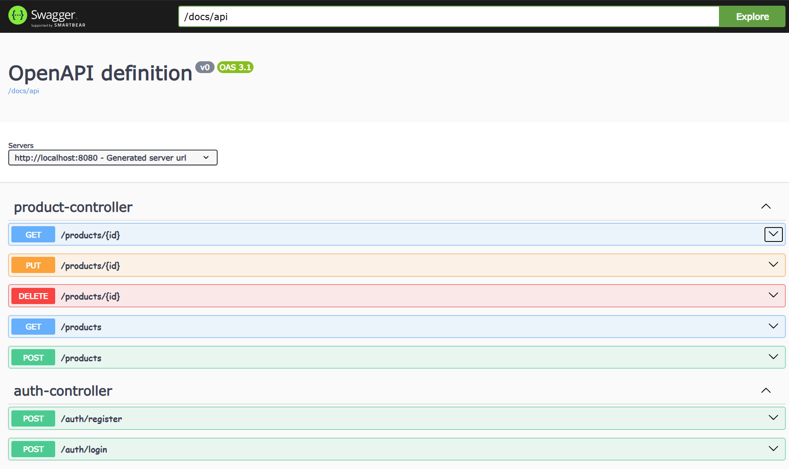

## E-Shop API Demo

A demo api built on the top of Java 21,and Spring Boot with basic authentication and authorization

### Prerequisite

- Java 17 or 21
- IntelliJ IDEA community
- Visual Studio Code
  - Java Extension
  - Spring Boot Dashboard
  - Rest Client Extension
- Docker

### Java Environment Setup

This project requires Java 21. If you encounter `JAVA_HOME is set to an invalid directory` error, use the provided `java-setup.sh` script:

```bash
# Show current Java configuration
./java-setup.sh current

# List all installed Java versions
./java-setup.sh list

# Automatically fix Java environment for this project (sets Java 21)
./java-setup.sh fix

# Manually set a specific Java version
./java-setup.sh set 21
```

The script will update both your current terminal session and your `~/.zshrc` file for future sessions.

### Setting up PostgreSQL Database

To set up the PostgreSQL database for this project, we recommend using the db-samples repository which provides a pre-configured PostgreSQL container.

#### Step 1: Clone the db-samples repository

```bash
git clone https://github.com/harryho/db-samples.git
cd db-samples
```

#### Step 2: Create the postgres-infra container

```bash
# Start the PostgreSQL container
docker compose up -d postgres-infra
```

#### Step 3: Create database `eshop` for test and development

```bash
# Login to postgres server and create the eshop database
docker exec -it postgres-infra psql -U postgres -d postgres

postgres=# create database eshop;
CREATE DATABASE
postgres=# grant all on database eshop to postgres;
GRANT
postgres=# \q
```

Alternatively, you can create the database using a single command:

```bash
docker exec -it postgres-infra psql -U postgres -d postgres -c "CREATE DATABASE eshop;"
```

#### Using the Database Setup Script (Recommended)

For convenience, we provide a `db-setup.sh` script that simplifies database management:

```bash
# Create the database
./db-setup.sh create

# Drop the database
./db-setup.sh drop

# Drop and recreate the database (useful for resetting)
./db-setup.sh recreate

# Show database information and status
./db-setup.sh info

# Open psql shell for the eshop database
./db-setup.sh shell
```

The script will automatically check if the postgres-infra container is running and handle database operations safely.

### Starting E-Shop  API

- Option 1: Run & Debug from IntelliJ IDEA

- Option 2: Run & Debug from Visual Studio Code via Spring Boot Dashboard

- Option 3: Use command

  ```powershell
  cd <repository_location>
  .\gradlew bootRun

  #   .   ____          _            __ _ _
  #  /\\ / ___'_ __ _ _(_)_ __  __ _ \ \ \ \
  # ( ( )\___ | '_ | '_| | '_ \/ _` | \ \ \ \
  #  \\/  ___)| |_)| | | | | || (_| |  ) ) ) )
  #   '  |____| .__|_| |_|_| |_\__, | / / / /
  #  =========|_|==============|___/=/_/_/_/
  # 
  #  :: Spring Boot ::                (v3.4.3)
  #
  # ...................................................
  # ...................................................
  # Database available at 'jdbc:postgresql://localhost:5432/eshop'
  # Tomcat started on port 8080 (http) with context path '/'
  ```


### Test E-Shop API via Rest Client

- Update the port in file `local-test.http` if you have a different port.
- Add user via endpoint `auth` first

```powershell
### Register staff user
POST http://localhost:{{PORT}}/auth/register HTTP/1.1
content-type: application/json

{
    "firstname": "John",
    "lastname": "Doe",
    "email": "john.doe@test.com",
    "password": "password",
    "role": "STAFF"
}


### Register admin user
POST http://localhost:{{PORT}}/auth/register HTTP/1.1
content-type: application/json

{
    "firstname": "Harry",
    "lastname": "Ho",
    "email": "harry.ho@test.com",
    "password": "password",
    "role": "ADMIN"
}

```
- Test login by retrieving access token
- Test endpoint `/products` by adding new product to database 
- Execute the GET requests. You will see some results as below.
  
```http
HTTP/1.1 200 OK
Connection: close
Content-Type: application/json; charset=utf-8
Date: Wed, 12 Mar 2025 14:23:11 GMT
Server: Kestrel
Transfer-Encoding: chunked

[
  {
    "id": 4,
    "name": "Anta Waffle Racer Crater",
    "genre": "Basket Shoes",
    "unitPrice": 22.88,
    "unitInStock": 12,
    "releaseDate": "2020-09-30T00:00:00",
    "imageUri": "https://dummyimage.com/200x200/eee/000"
  },
  {
    "id": 5,
    "name": "XTEP AntaCourt Royale",
    "genre": "Tennis Shoes",
    "unitPrice": 39.99,
    "unitInStock": 11,
    "releaseDate": "2021-09-30T00:00:00",
    "imageUri": "https://dummyimage.com/200x200/eee/000"
  }
]
```
 


### Swagger 

Access Swagger on browser
`https://localhost:<YOUR_API_PORT>/docs/swagger-ui/index.html`



